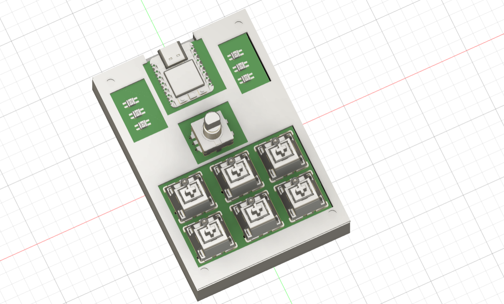
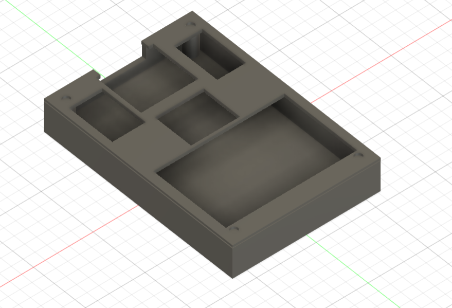

XIAO RP2040 6-Key Macropad BOM

A simple 6-button macropad with rotary encoder, RGB LEDs, and OLED display running KMK firmware on CircuitPython. I made this to control my music easier with play/pause buttons and volume up, down, and mute.

1x Seeed XIAO RP2040

1x Header pins for the XIAO (usually included, do NOT solder the board flat)

6x Mechanical Switches (MX-Style)

1x EC11 Rotary Encoder (5-pin)

1x Knob for Encoder

6x Blank DSA Keycaps (White)

1x 0.91" OLED Display (Pin order must be GND-VCC-SCL-SDA)

6x SK6812 MINI-E LEDs (Reverse mount with legs)

7x 1N4148 Diodes (Through-Hole)

1x 3D Printed Case (PLA/PETG, not Acrylic)

4x M3 x 16mm Screws

4x M3 Heat-Set Inserts (M3x5mmx4mm)

Wire (24-28 AWG)

## Pictures

